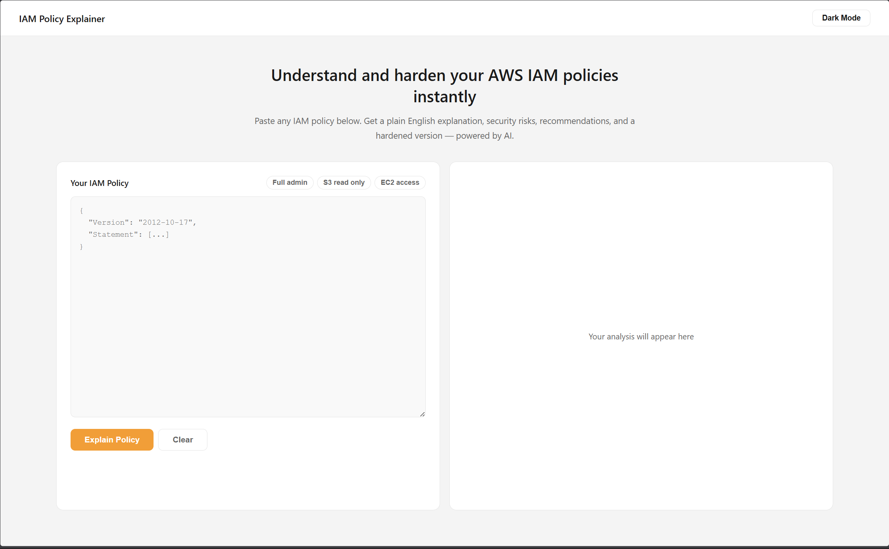

<div align="center">

# IAM Policy Explainer

**Understand and harden your AWS IAM policies instantly — powered by AI**

[](https://python.org)
[](https://flask.palletsprojects.com)
[](https://aws.amazon.com)
[](https://anthropic.com)

[**Live Demo**](http://iam-explainer-jawad-2026.s3-website-us-east-1.amazonaws.com) • [**How It Works**](#how-it-works) • [**Run Locally**](#running-locally)

</div>

---
## What It Does

Paste any AWS IAM policy and instantly get:

- Plain English explanation of what the policy allows
- Security risk analysis with High/Low severity rating
- Actionable recommendations with specific fixes
- A fully hardened version of the policy ready to copy and use

---

## Why I Built This

IAM policies are one of the most misunderstood parts of AWS. Junior engineers copy policies from Stack Overflow without understanding what they allow. Non-technical founders have no idea if their infrastructure is secure.

Existing tools either require an AWS account, live in the terminal, or don't generate a fixed version. This is the only no-signup web interface that explains and hardens your policy in one click.

---

## Screenshot



---

## Architecture
```
User Browser
     |
     v
AWS S3 (Static Frontend)
HTML + CSS + JavaScript
     |
     v
AWS EC2 (Flask Backend)
Python + Gunicorn + systemd
     |
     v
Anthropic Claude API
claude-haiku-4-5-20251001
```

---

## Tech Stack

| Layer | Technology |
|-------|------------|
| Frontend | HTML, CSS, Vanilla JavaScript |
| Backend | Python, Flask, Gunicorn |
| AI | Anthropic Claude Haiku |
| Backend Hosting | AWS EC2 t2.micro |
| Frontend Hosting | AWS S3 Static Website |
| Infrastructure | Elastic IP, Security Groups, systemd |

---

## Project Structure
```
iam-policy-explainer/
├── backend/
│   ├── app.py              # Flask API and Claude integration
│   ├── requirements.txt    # Python dependencies
│   └── .env.example        # Environment variables template
├── frontend/
│   ├── index.html          # App structure
│   ├── style.css           # Styling and dark mode
│   └── script.js           # API calls and UI logic
└── README.md
```

---

## Running Locally

**Prerequisites**
- Python 3.8+
- Anthropic API key from console.anthropic.com

**Setup**
```bash
# Clone the repo
git clone https://github.com/zaanngo/iam-policy-explainer.git
cd iam-policy-explainer/backend

# Create virtual environment
python3 -m venv venv
source venv/bin/activate

# Install dependencies
pip install -r requirements.txt

# Configure environment
cp .env.example .env
# Open .env and add your ANTHROPIC_API_KEY

# Run the backend
python3 app.py
```

Then open `frontend/index.html` in your browser.

---

## What I Learned

- Building and deploying a Flask REST API from scratch
- Integrating Claude AI with structured JSON prompt engineering
- AWS EC2 deployment — SSH, security groups, systemd services
- AWS S3 static website hosting and bucket policies
- Connecting frontend to backend across different origins (CORS)
- Managing secrets securely with environment variables
- Linux server administration on Amazon Linux

---

## Future Improvements

- [ ] HTTPS via CloudFront and Let's Encrypt
- [ ] Support for AWS SCPs (Service Control Policies)
- [ ] Side by side policy comparison
- [ ] Generate a policy from plain English description
- [ ] OpenAI and Gemini provider support
- [ ] User authentication with AWS Cognito

---

## Author

Built by Adnan Nazir Ahmed — a cloud engineer learning AWS by building real tools.

[](https://github.com/zaanngo)
